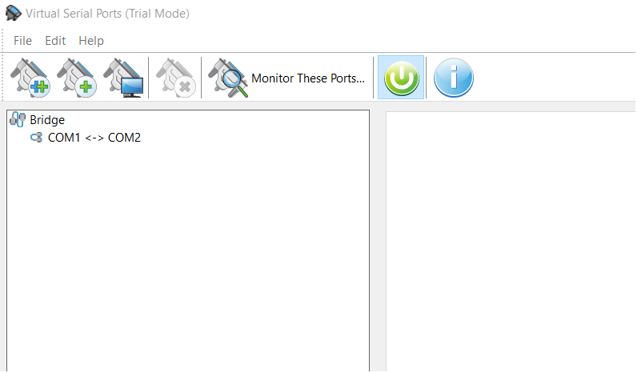
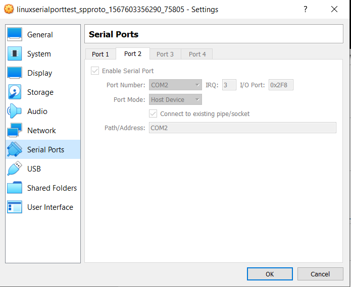

## Create virtual serial ports

Download http://www.hhdsoftware.com/Download/virtual-serial-ports.exe

Create virtual ports COM1 and COM2 and create bridge between them.

## Connect virtual box serial port to host port

